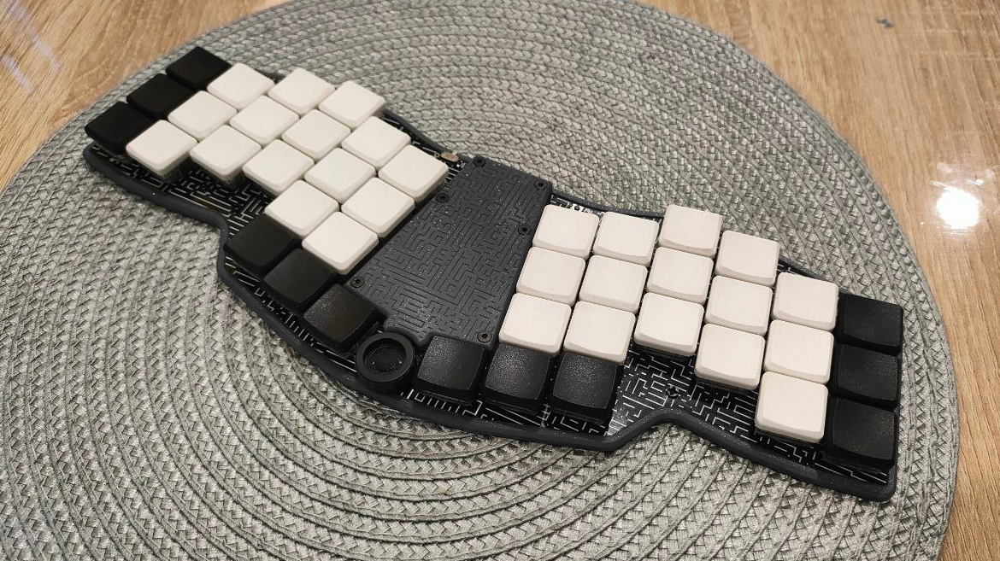
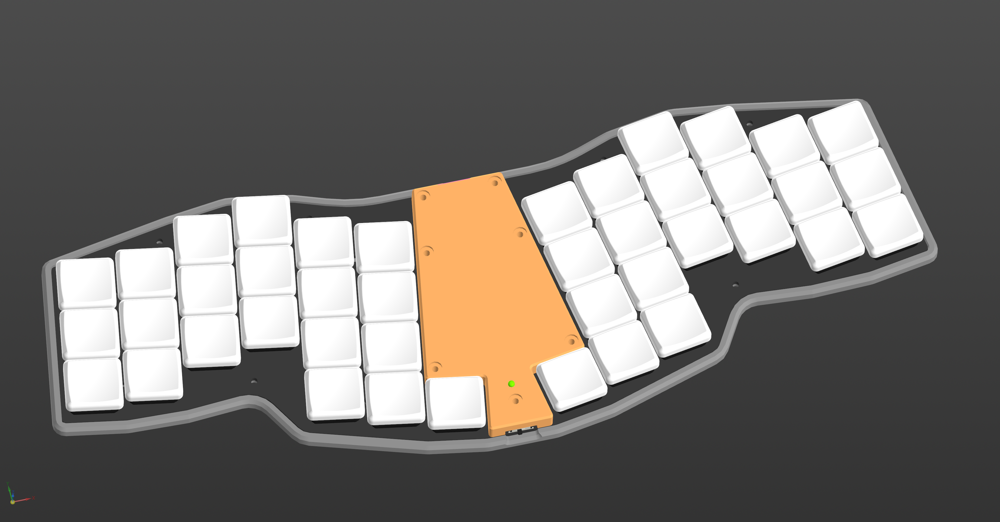

# mEnki
mEnki is a unibody split edition of the Enki ergonomic keyboard with 42-key layouts. Currently, only the case and optional plate files are available.

## Main features:
* 42 Choc v1 switches
* Magnets in the case to securely hold the keyboard halves together
* Easily accessible power switch and reset button
* Bluetooth support
* Choc spacing for compactness and comfort
* As thin as possible
* RGB led indicator
* Encoder (V2 only)
* [ZMK firmware](https://github.com/aroum/zmk-gbEnki)

## ZMK firmware
ZMK Firmware config with status indicator support can be downloaded [here](https://github.com/aroum/zmk-mEnki).

--------------
## Case variations:
### mEnki v1 
#### Laser

#### Plate

#### Washtub (Bridge)

### mEnki v2
#### Laser

#### Plate

#### Washtub (Bridge)
